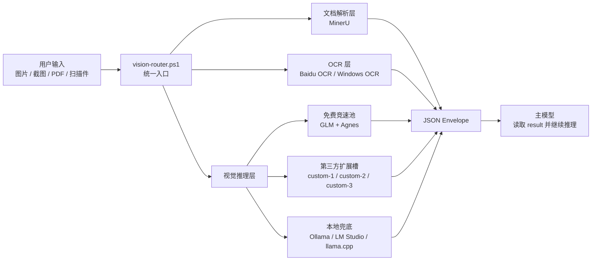
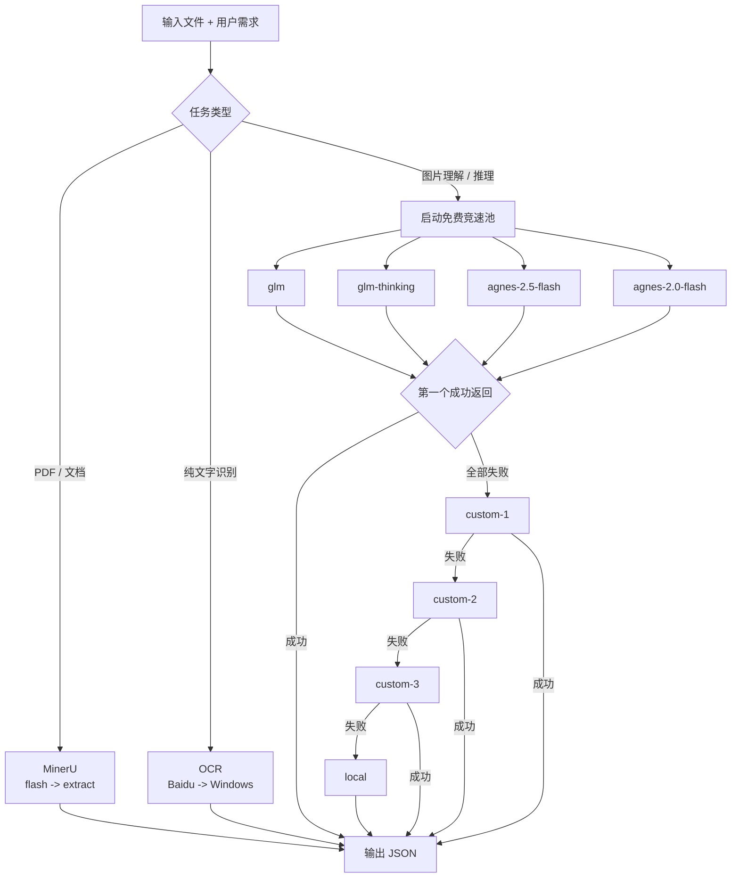
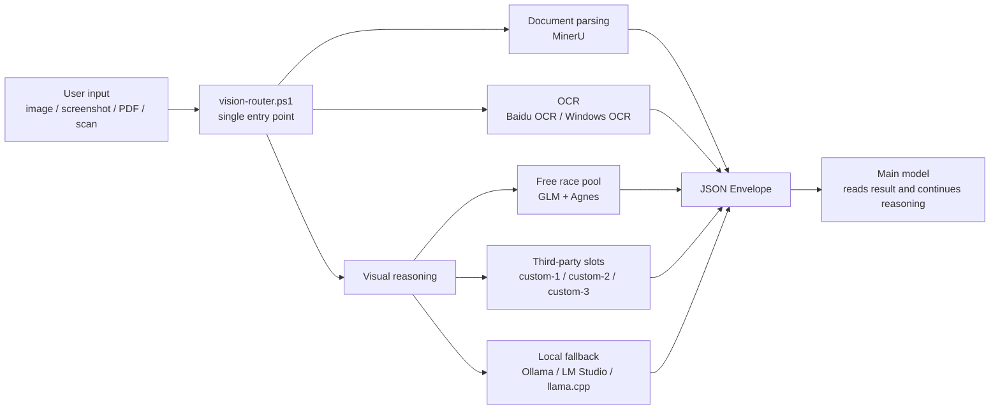
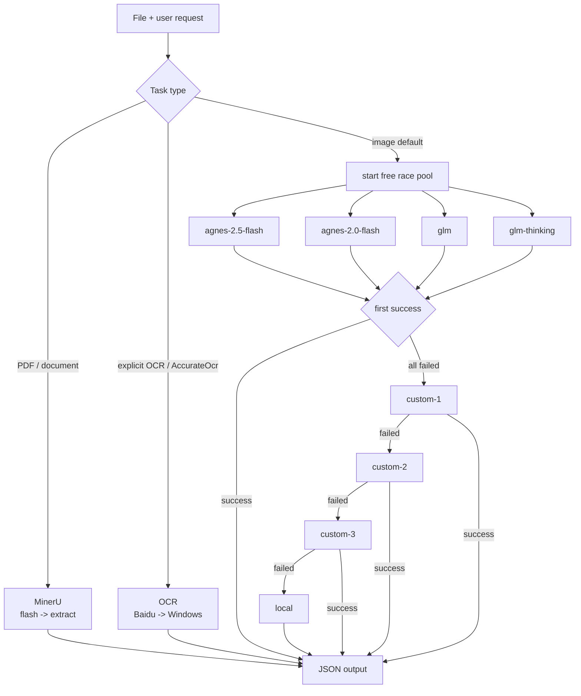

# ds-vision-skill

Language: [中文](#中文) | [English](#english)

`ds-vision-skill` is a vision layer for text-first agents. It routes images, screenshots, PDFs, scans, charts, UI captures, code screenshots, and math images into OCR, document parsing, or visual reasoning, then returns a clean JSON envelope for the main model to reason over.

The recommended setup is:

```text
first configure the free race pool -> optionally fill custom-1/custom-2/custom-3 -> use vision-router.ps1
```

---

## 中文

### 一句话

这是给 Codex / DeepSeek / 纯文本推理模型用的“视觉前置层”。用户给一张图或一个 PDF，它负责识别任务、选择通道、并发竞速、失败降级，最后把可读结果交给主模型。

### 下载后第一步：配置免费竞速池

免费竞速池是默认主路径。建议用户安装 skill 后优先配置这两组 key：

```powershell
# GLM: 同一个 key 同时启用 glm + glm-thinking
scripts\setup.ps1 -SetKey -Channel glm -Key <GLM_API_KEY> -Verify

# Agnes: 同一个 key 同时启用 agnes-2.5-flash + agnes-2.0-flash
scripts\setup.ps1 -SetKey -Channel agnes-2.5-flash -Key <AGNES_API_KEY> -Verify
```

配置完成后，图片理解会并发调用：

```text
glm
glm-thinking
agnes-2.5-flash
agnes-2.0-flash
```

谁先成功返回，就采用谁的结果。这个设计的目标是快：免费通道一起跑，不等最慢的那个。

### 可选：3 个第三方模型空槽

如果用户有自己的 OpenAI-compatible 视觉模型、中转服务或私有模型，可以填入这 3 个空闲通道：

```powershell
scripts\setup.ps1 -SetCustom -Slot 1 -BaseUrl <url> -Key <key> -Model <model> -Verify
scripts\setup.ps1 -SetCustom -Slot 2 -BaseUrl <url> -Key <key> -Model <model> -Verify
scripts\setup.ps1 -SetCustom -Slot 3 -BaseUrl <url> -Key <key> -Model <model> -Verify
```

它们对应：

```text
custom-1
custom-2
custom-3
```

免费竞速池全部失败后，才会按顺序尝试这 3 个第三方槽位。

### 系统架构



### 请求流程



### 快速使用

检查状态：

```powershell
scripts\setup.ps1 -Status
scripts\preflight.ps1
```

统一入口：

```powershell
scripts\vision-router.ps1 -Path <文件路径> -Prompt "请分析这个文件" -Json
```

指定 OCR：

```powershell
scripts\vision-router.ps1 -Path <图片路径> -Intent ocr -Json
```

指定文档解析：

```powershell
scripts\vision-router.ps1 -Path <PDF路径> -Intent document -Json
```

### 通道表

| 分组 | 通道 | 环境变量 | 说明 |
|---|---|---|---|
| 免费竞速池 | `glm` | `GLM_API_KEY` | 快速视觉理解 |
| 免费竞速池 | `glm-thinking` | `GLM_API_KEY` | 复杂视觉推理 |
| 免费竞速池 | `agnes-2.5-flash` | `AGNES_API_KEY` | 默认 endpoint: `https://api.agnes-ai.cn/v1/chat/completions` |
| 免费竞速池 | `agnes-2.0-flash` | `AGNES_API_KEY` | 默认 endpoint: `https://api.agnes-ai.cn/v1/chat/completions` |
| 第三方空槽 | `custom-1` | `VISION_CUSTOM_1_*` | 用户自己的 OpenAI-compatible 模型 |
| 第三方空槽 | `custom-2` | `VISION_CUSTOM_2_*` | 用户自己的 OpenAI-compatible 模型 |
| 第三方空槽 | `custom-3` | `VISION_CUSTOM_3_*` | 用户自己的 OpenAI-compatible 模型 |
| OCR | `baidu-ocr` | `BAIDU_API_KEY` + `BAIDU_SECRET_KEY` | 云端 OCR |
| OCR | `windows-ocr` | 无 | Windows 本地 OCR |
| 文档 | `mineru` | `MINERU_TOKEN` 可选 | PDF / 文档解析 |
| 本地兜底 | `local` | `VISION_LOCAL_MODEL` 可选 | Ollama / LM Studio / llama.cpp |

### 输出格式

```json
{
  "task_type": "image_reasoning | document_parsing | ocr",
  "tool_used": "actual tool or model",
  "confidence": "high | medium | low",
  "result": "识别、解析或理解后的内容",
  "metadata": {}
}
```

### 隐私和降级

云端通道会把文件内容发送给对应服务商。处理合同、证件、医疗、财务等敏感内容时，建议优先使用 Windows OCR、本地模型，或在发送前取得用户确认。

视觉推理降级顺序：

```text
race(free pool) -> custom-1 -> custom-2 -> custom-3 -> local
```

### 更新

```powershell
scripts\check-update.ps1
scripts\check-update.ps1 -Notify
scripts\update-skill.ps1
```

本地安装不会自动跟随 GitHub 更新。`update-skill.ps1` 只更新 git clone 形式安装的目录，并且有本地改动时会拒绝覆盖。

---

## English

### In One Sentence

`ds-vision-skill` is a vision front-end for text-first agents: it detects the task, chooses the right visual route, races free channels when possible, falls back cleanly, and returns structured JSON to the main model.

### First Step After Install: Configure The Free Race Pool

The free race pool is the default fast path. Configure it first:

```powershell
# GLM enables both glm and glm-thinking
scripts\setup.ps1 -SetKey -Channel glm -Key <GLM_API_KEY> -Verify

# Agnes enables both agnes-2.5-flash and agnes-2.0-flash
scripts\setup.ps1 -SetKey -Channel agnes-2.5-flash -Key <AGNES_API_KEY> -Verify
```

For image reasoning, these channels run concurrently:

```text
agnes-2.5-flash
agnes-2.0-flash
glm
glm-thinking
```

The first successful response wins.

In `auto` mode, image files route to image reasoning by default, so the free
race pool is tried first. Use `-Intent ocr` for OCR-only extraction, or
`-AccurateOcr` when a scanned or low-quality text image should go straight to
the OCR route.

### Optional: Three Third-Party Slots

Users can plug in their own OpenAI-compatible vision models:

```powershell
scripts\setup.ps1 -SetCustom -Slot 1 -BaseUrl <url> -Key <key> -Model <model> -Verify
scripts\setup.ps1 -SetCustom -Slot 2 -BaseUrl <url> -Key <key> -Model <model> -Verify
scripts\setup.ps1 -SetCustom -Slot 3 -BaseUrl <url> -Key <key> -Model <model> -Verify
```

These become:

```text
custom-1
custom-2
custom-3
```

They are tried only after the free race pool fails.

### Architecture



### Request Flow



### Quick Use

```powershell
scripts\setup.ps1 -Status
scripts\preflight.ps1
scripts\vision-router.ps1 -Path <file> -Prompt "Analyze this file" -Json
```

### Routing

```text
image reasoning: race(agnes-2.5-flash, agnes-2.0-flash, glm, glm-thinking) -> custom-1 -> custom-2 -> custom-3 -> local
ocr: baidu-ocr -> windows-ocr -> vision reasoning
auto image default: image reasoning / free race pool first
document: mineru flash -> mineru extract
```

### JSON Output

```json
{
  "task_type": "image_reasoning | document_parsing | ocr",
  "tool_used": "actual tool or model",
  "confidence": "high | medium | low",
  "result": "recognized, parsed, or understood content",
  "metadata": {}
}
```

### Version And Updates

```powershell
scripts\check-update.ps1
scripts\check-update.ps1 -Notify
scripts\update-skill.ps1
```

Installed skills are local copies. GitHub updates do not automatically update a user's local installation.

### License

MIT
