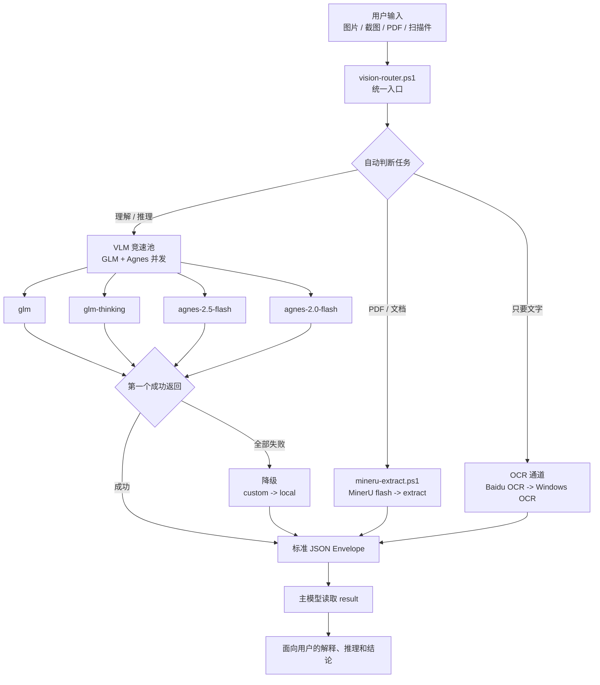
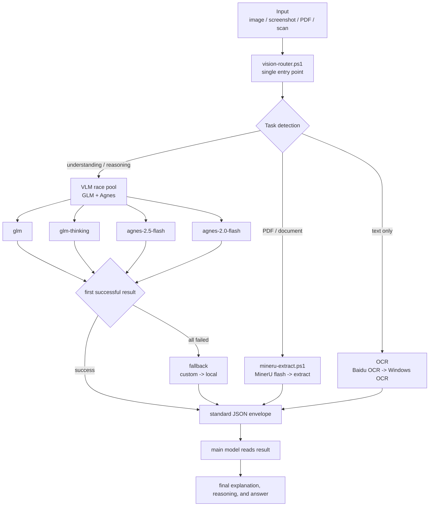

# ds-vision-skill

Language: [中文](#中文) | [English](#english)

`ds-vision-skill` gives text-first coding agents a practical vision layer. It turns images, screenshots, scanned files, PDFs, charts, UI screenshots, code screenshots, and math-problem images into readable text or a standard JSON envelope, then hands the result back to the main model for reasoning.

The core idea is simple: keep the main model focused on thinking, and let this skill choose the fastest useful visual tool.

---

## 中文

### 它解决什么

很多纯文本模型本身不直接“看图”，但工作里经常会遇到截图、票据、PDF、图表、网页 UI、代码报错截图、数学题图片。这个 skill 就是一个视觉前置层：

- 图片理解：描述图片、读 UI、分析截图、理解代码截图
- OCR：提取票据、扫描件、表单、截图里的文字
- 图表推理：分析趋势图、架构图、流程图、数学题图片
- 文档解析：处理 PDF、论文、报告、长文档和扫描件

### 核心特点

- 统一入口：优先调用 `scripts/vision-router.ps1`
- 自动路由：根据文件类型和意图选择图片理解、OCR 或文档解析
- 免费通道竞速：GLM 两个模型 + Agnes 两个模型并发调用，谁先成功就用谁
- 明确降级：免费云通道失败后再走 custom / local
- 结构化输出：所有工具在 `-Json` 模式下输出统一 envelope
- 隐私优先：敏感内容可优先走 Windows OCR 或本地模型
- 可更新：内置版本检查和显式更新脚本

### 架构图



### 运行流程

1. 用户给出一个文件和需求。
2. `vision-router.ps1` 判断任务是 `document`、`ocr` 还是 `reason`。
3. 文档走 MinerU，纯文字走 OCR。
4. 图片理解会同时启动已配置的免费云视觉通道：

```text
glm
glm-thinking
agnes-2.5-flash
agnes-2.0-flash
```

5. 第一个成功返回的通道成为 winner，其余请求会被停止清理。
6. 如果免费通道全部失败，再尝试 `custom` 和 `local`。
7. 最终输出统一 JSON，主模型只需要读取 `result` 继续推理。

### 快速开始

检查可用通道：

```powershell
scripts\setup.ps1 -Status
scripts\preflight.ps1
```

推荐统一入口：

```powershell
scripts\vision-router.ps1 -Path <文件路径> -Prompt "请分析这个文件" -Json
```

指定 OCR：

```powershell
scripts\vision-router.ps1 -Path <图片路径> -Intent ocr -Json
```

指定复杂视觉推理：

```powershell
scripts\vision-router.ps1 -Path <图片路径> -Intent reason -Complex -Prompt "分析这张图表的趋势" -Json
```

指定文档解析：

```powershell
scripts\vision-router.ps1 -Path <PDF路径> -Intent document -Json
```

### 配置云通道

GLM：

```powershell
scripts\setup.ps1 -SetKey -Channel glm -Key <GLM_API_KEY> -Verify
```

Agnes：

```powershell
scripts\setup.ps1 -SetKey -Channel agnes-2.5-flash -Key <AGNES_API_KEY> -Verify
scripts\setup.ps1 -SetKey -Channel agnes-2.0-flash -Key <AGNES_API_KEY> -Verify
```

Baidu OCR：

```powershell
scripts\setup.ps1 -SetKey -Channel baidu-ocr -Key <BAIDU_API_KEY> -Secret <BAIDU_SECRET_KEY> -Verify
```

OpenAI-compatible custom relay：

```powershell
scripts\setup.ps1 -SetCustom -BaseUrl <url> -Key <key> -Model <model> -Verify
```

移除配置：

```powershell
scripts\setup.ps1 -RemoveKey -Channel <glm|glm-thinking|agnes-2.5-flash|agnes-2.0-flash|baidu-ocr|custom>
```

### 通道说明

| 通道 | 用途 | 环境变量 | 备注 |
|---|---|---|---|
| `glm` | 快速图片理解 | `GLM_API_KEY` | 免费竞速池 |
| `glm-thinking` | 复杂视觉推理 | `GLM_API_KEY` | 免费竞速池 |
| `agnes-2.5-flash` | Agnes 快速视觉理解 | `AGNES_API_KEY` | 默认 endpoint: `https://api.agnes-ai.cn/v1/chat/completions` |
| `agnes-2.0-flash` | Agnes 备用快速视觉理解 | `AGNES_API_KEY` | 默认 endpoint: `https://api.agnes-ai.cn/v1/chat/completions` |
| `custom` | OpenAI 兼容中转 | `VISION_CUSTOM_*` | 私有或第三方服务 |
| `baidu-ocr` | 云端 OCR | `BAIDU_API_KEY` + `BAIDU_SECRET_KEY` | token 自动缓存 |
| `windows-ocr` | Windows 本地 OCR | 无 | 隐私优先、离线可用 |
| `mineru` | PDF / 文档解析 | `MINERU_TOKEN` 可选 | flash 模式优先 |
| `local` | 本地视觉模型 | `VISION_LOCAL_MODEL` 可选 | Ollama / LM Studio / llama.cpp |

### 输出格式

所有脚本在 `-Json` 模式下输出统一结构：

```json
{
  "task_type": "image_reasoning | document_parsing | ocr",
  "tool_used": "actual tool or model",
  "confidence": "high | medium | low",
  "result": "识别、解析或理解后的内容",
  "metadata": {}
}
```

主模型通常只需要读取 `result` 字段继续推理；调试时再查看 `tool_used` 和 `metadata`。

### 目录结构

```text
SKILL.md
README.md
VERSION
version.json
agents/openai.yaml
references/channels.md
scripts/
  vision-router.ps1      # 推荐入口：自动判断任务、并发竞速、降级
  vlm-vision.ps1         # 视觉理解：glm / glm-thinking / agnes / custom / local
  baidu-ocr.ps1          # 百度 OCR，带 token 缓存
  windows-ocr.ps1        # Windows 离线 OCR
  mineru-extract.ps1     # MinerU 文档解析，带结果缓存
  preflight.ps1          # 通道预检，支持 -Json
  setup.ps1              # 配置 key、状态和验证
  local-select.ps1       # 本地视觉模型选型
  smoke-test.ps1         # 轻量自检
  check-update.ps1       # 检查 GitHub 上的新版本
  update-skill.ps1       # 显式更新 git clone 安装
```

### 缓存策略

- `vlm-vision.ps1` 按图片 hash、prompt、通道和模型缓存结果
- `baidu-ocr.ps1` 缓存百度 access token
- `mineru-extract.ps1` 按文件 hash 复用已生成的 Markdown

缓存默认位于用户目录下的 `.ds-vision`，以及系统临时目录中的 MinerU 输出目录。

### 隐私提醒

云端通道会把图片或文档发送给对应服务商。处理合同、证件、医疗、财务或其他敏感内容时，建议优先使用 Windows OCR、本地模型，或在发送前取得用户确认。

### 版本和更新

这个 skill 安装到本地后，不会因为 GitHub 仓库更新而自动同步。

```powershell
scripts\check-update.ps1
scripts\check-update.ps1 -Json
scripts\check-update.ps1 -Notify
scripts\update-skill.ps1
```

`-Notify` 会在发现新版本时给出非阻断提醒，默认同一个新版本 24 小时最多提醒一次。`update-skill.ps1` 只会更新 git clone 形式安装的目录，并且有本地改动时会拒绝覆盖。

---

## English

### What It Does

`ds-vision-skill` is a vision adapter for text-first agents. It converts visual inputs into text or structured JSON before the main model continues the reasoning.

It is useful for:

- image and screenshot understanding
- OCR for receipts, forms, scanned files, and screenshots
- chart, diagram, UI, code screenshot, and math-image reasoning
- PDF, paper, report, table, and formula parsing

### Highlights

- One recommended entry point: `scripts/vision-router.ps1`
- Automatic routing across document parsing, OCR, and visual reasoning
- Concurrent free-channel racing: GLM + Agnes models run in parallel
- First successful response wins
- Clear fallback chain: free cloud race -> custom relay -> local runtime
- Standard JSON output for agent-friendly downstream reasoning
- Privacy-aware local OCR and local vision fallback
- Built-in version check and explicit update script

### Architecture



### Quick Start

Check available channels:

```powershell
scripts\setup.ps1 -Status
scripts\preflight.ps1
```

Use the router:

```powershell
scripts\vision-router.ps1 -Path <file> -Prompt "Analyze this file" -Json
```

OCR:

```powershell
scripts\vision-router.ps1 -Path <image> -Intent ocr -Json
```

Complex visual reasoning:

```powershell
scripts\vision-router.ps1 -Path <image> -Intent reason -Complex -Prompt "Analyze this chart" -Json
```

Document parsing:

```powershell
scripts\vision-router.ps1 -Path <pdf> -Intent document -Json
```

### Configure Channels

GLM:

```powershell
scripts\setup.ps1 -SetKey -Channel glm -Key <GLM_API_KEY> -Verify
```

Agnes:

```powershell
scripts\setup.ps1 -SetKey -Channel agnes-2.5-flash -Key <AGNES_API_KEY> -Verify
scripts\setup.ps1 -SetKey -Channel agnes-2.0-flash -Key <AGNES_API_KEY> -Verify
```

Baidu OCR:

```powershell
scripts\setup.ps1 -SetKey -Channel baidu-ocr -Key <BAIDU_API_KEY> -Secret <BAIDU_SECRET_KEY> -Verify
```

Custom OpenAI-compatible relay:

```powershell
scripts\setup.ps1 -SetCustom -BaseUrl <url> -Key <key> -Model <model> -Verify
```

### Routing Strategy

For image reasoning, configured free cloud channels are launched concurrently:

```text
race(glm, glm-thinking, agnes-2.5-flash, agnes-2.0-flash) -> custom -> local
```

For OCR:

```text
baidu-ocr -> windows-ocr -> vision reasoning
```

For documents:

```text
mineru flash -> mineru extract
```

### JSON Output

```json
{
  "task_type": "image_reasoning | document_parsing | ocr",
  "tool_used": "actual tool or model",
  "confidence": "high | medium | low",
  "result": "recognized, parsed, or understood content",
  "metadata": {}
}
```

### Version and Updates

Installed skills are local copies. Updating GitHub does not automatically update a user's local installation.

```powershell
scripts\check-update.ps1
scripts\check-update.ps1 -Json
scripts\check-update.ps1 -Notify
scripts\update-skill.ps1
```

`update-skill.ps1` only updates git-clone installations and refuses to overwrite local changes.

### License

MIT
