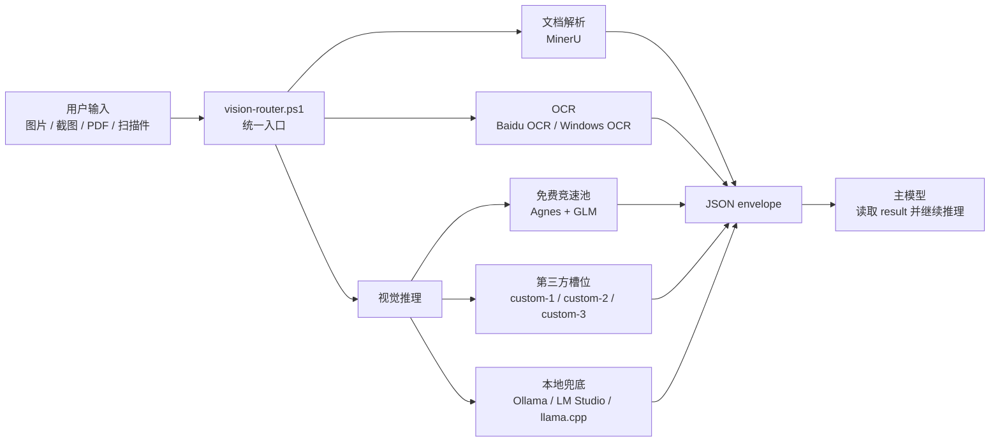
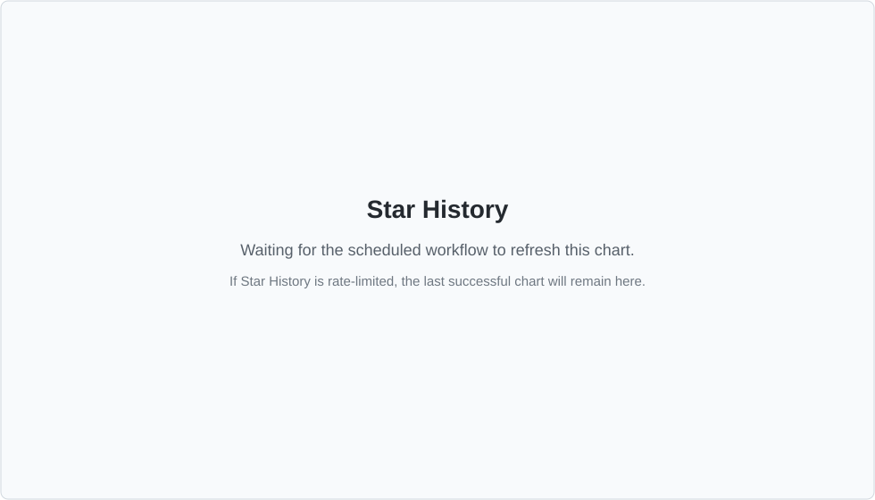

# DS Vision Skill

<p align="center">
  <strong>给纯文本智能体使用的快速、可降级视觉前置层。</strong>
</p>

<p align="center">
  <a href="README.md">English</a>
  ·
  <a href="SKILL.md">Skill 规范</a>
  ·
  <a href="references/channels.md">通道表</a>
  ·
  <a href="LICENSE">许可证</a>
</p>

<p align="center">
  <a href="https://github.com/Sorwcyra/ds-vision-skill/stargazers"></a>
  <a href="https://github.com/Sorwcyra/ds-vision-skill/forks"></a>
  <a href="https://github.com/Sorwcyra/ds-vision-skill/commits/main"></a>
  <a href="https://github.com/Sorwcyra/ds-vision-skill/issues"></a>
  <a href="LICENSE"></a>
  <a href="VERSION"></a>
  <a href="https://github.com/Sorwcyra/ds-vision-skill"></a>
</p>

让纯文本智能体更自然地处理图片、截图、扫描件、PDF、图表、UI 截图、代码截图和数学题图片。

它不替代主模型，而是作为视觉前置层：识别任务、选择路线、并发调用可用的快速视觉通道、在失败时逐级降级，最后返回统一的 JSON，交给主模型继续推理。

## 为什么需要它

很多推理或编程智能体擅长文字，但遇到视觉输入时会比较笨重。这个 skill 专门负责把视觉输入变成可靠的文本或结构化结果：

| 需求 | 路由 |
|---|---|
| 理解截图、图表、UI、照片或数学图片 | 视觉推理竞速池 |
| 从图片或扫描件提取纯文字 | Baidu OCR，然后 Windows OCR |
| 解析 PDF、报告、论文或多页文档 | MinerU |
| 使用自己的私有模型或中转服务 | `custom-1`、`custom-2`、`custom-3` |
| 敏感内容尽量本地处理 | 本地运行时兜底 |

## 快速开始

先配置免费竞速池：

```powershell
# GLM: 同一个 key 同时启用 glm + glm-thinking
scripts\setup.ps1 -SetKey -Channel glm -Key <GLM_API_KEY> -Verify

# Agnes: 同一个 key 同时启用 agnes-2.5-flash + agnes-2.0-flash
scripts\setup.ps1 -SetKey -Channel agnes-2.5-flash -Key <AGNES_API_KEY> -Verify
```

检查环境：

```powershell
scripts\setup.ps1 -Status
scripts\preflight.ps1
```

通过统一入口分析文件：

```powershell
scripts\vision-router.ps1 -Path <文件路径> -Prompt "请分析这个文件" -Json
```

任务明确时可以指定路由：

```powershell
scripts\vision-router.ps1 -Path <图片路径> -Intent ocr -Json
scripts\vision-router.ps1 -Path <PDF路径> -Intent document -Json
scripts\vision-router.ps1 -Path <图片路径> -Intent reason -Complex -Json
```

## 路由模型



### 降级顺序

```text
图片理解: race(agnes-2.5-flash, agnes-2.0-flash, glm, glm-thinking) -> custom-1 -> custom-2 -> custom-3 -> local
OCR: baidu-ocr -> windows-ocr -> vision reasoning
文档解析: mineru flash -> mineru extract
```

在 `auto` 模式下，图片默认先进入视觉推理。纯 OCR 请使用 `-Intent ocr`；低清扫描件或票据类图片可以使用 `-AccurateOcr`。

## 支持的通道

| 分组 | 通道 | 环境变量 | 用途 |
|---|---|---|---|
| 免费竞速池 | `agnes-2.5-flash` | `AGNES_API_KEY` | 快速 OpenAI-compatible 视觉模型 |
| 免费竞速池 | `agnes-2.0-flash` | `AGNES_API_KEY` | 备用快速视觉模型 |
| 免费竞速池 | `glm` | `GLM_API_KEY` | 快速 GLM 视觉理解 |
| 免费竞速池 | `glm-thinking` | `GLM_API_KEY` | 更复杂的视觉推理 |
| 第三方槽位 | `custom-1` | `VISION_CUSTOM_1_*` | 用户自有 OpenAI-compatible 模型 |
| 第三方槽位 | `custom-2` | `VISION_CUSTOM_2_*` | 用户自有 OpenAI-compatible 模型 |
| 第三方槽位 | `custom-3` | `VISION_CUSTOM_3_*` | 用户自有 OpenAI-compatible 模型 |
| OCR | `baidu-ocr` | `BAIDU_API_KEY` + `BAIDU_SECRET_KEY` | 云端 OCR |
| OCR | `windows-ocr` | 无 | Windows 本地 OCR |
| 文档解析 | `mineru` | 可选 `MINERU_TOKEN` | PDF / 文档解析 |
| 本地兜底 | `local` | 可选 `VISION_LOCAL_MODEL` | Ollama、LM Studio 或 llama.cpp |

完整通道信息见 [references/channels.md](references/channels.md)。

## 第三方模型槽位

可以接入任意 OpenAI-compatible 视觉模型：

```powershell
scripts\setup.ps1 -SetCustom -Slot 1 -BaseUrl <url> -Key <key> -Model <model> -Verify
scripts\setup.ps1 -SetCustom -Slot 2 -BaseUrl <url> -Key <key> -Model <model> -Verify
scripts\setup.ps1 -SetCustom -Slot 3 -BaseUrl <url> -Key <key> -Model <model> -Verify
```

免费竞速池全部失败后，router 才会按顺序尝试这些槽位。

## JSON 输出约定

所有脚本在 `-Json` 模式下都输出同一种结构：

```json
{
  "task_type": "image_reasoning | document_parsing | ocr",
  "tool_used": "actual tool or model",
  "confidence": "high | medium | low",
  "result": "识别、解析或理解后的内容",
  "metadata": {}
}
```

主模型继续推理时应优先读取 `result`，需要解释路由或降级过程时再参考 `tool_used`、`confidence` 和 `metadata`。

## Star 趋势

<a href="https://www.star-history.com/?repos=Sorwcyra%2Fds-vision-skill&type=date&legend=top-left">
  
</a>

## 贡献者

欢迎贡献：bug 报告、通道修复、文档优化、新路由策略、更好的本地模型支持都很有价值。

<a href="https://github.com/Sorwcyra/ds-vision-skill/graphs/contributors">
  
</a>

提交 PR 前建议：

1. PowerShell 源码保持 ASCII-only。
2. 面向用户的 Markdown 使用 UTF-8。
3. 通道变更时同步更新路由文档。
4. 修改脚本后运行预检或冒烟测试。

```powershell
scripts\preflight.ps1
scripts\smoke-test.ps1
```

## 更新

```powershell
scripts\check-update.ps1
scripts\check-update.ps1 -Notify
scripts\update-skill.ps1
```

本地安装是本地副本，不会自动跟随 GitHub 更新。

## 隐私

云端通道会把文件内容发送给对应服务商。处理合同、证件、医疗、财务等敏感内容时，建议优先使用 Windows OCR 或本地模型，或者在发送前先取得用户确认。

## 许可证

本项目使用 [MIT License](LICENSE)。
